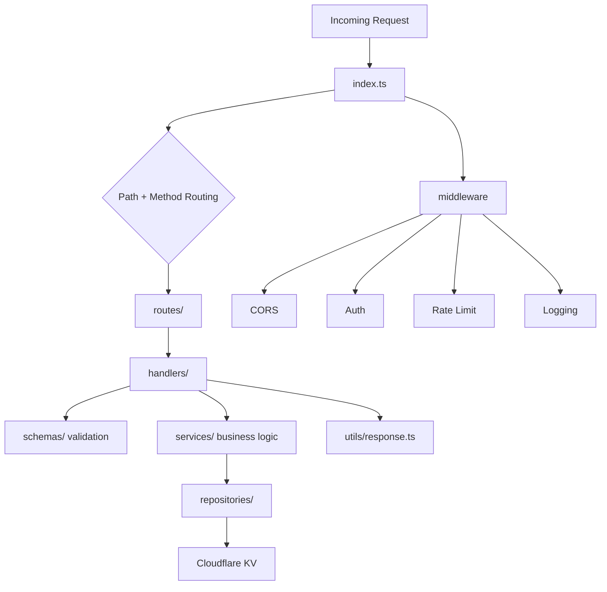

# Backend README

This backend is a Cloudflare Workers API designed to show staff-level full-stack engineering on the service side: clear boundaries, explicit runtime controls, pragmatic persistence, and test coverage that matches the platform.

## Executive Summary

The backend is intentionally more structured than a minimal Worker. That is the point. It demonstrates the ability to design for change, not just get an endpoint working.

- layered request processing
- validation at the HTTP boundary
- business logic isolated in services
- persistence isolated in repositories
- runtime controls for auth, rate limiting, CORS, and logging
- Worker-native test coverage and environment-aware deployment

## Architecture Diagram



## Request Lifecycle

```text
request
  -> index.ts
  -> route selection
  -> middleware checks
  -> handler orchestration
  -> schema validation
  -> service logic
  -> repository access
  -> JSON response
```

This is a straightforward structure, but it scales well because each layer has a clear reason to change.

## Directory Map

- `src/index.ts`: Worker entrypoint and top-level request dispatch
- `src/routes/`: path and method mapping
- `src/handlers/`: HTTP orchestration
- `src/schemas/`: request validation
- `src/services/`: business logic
- `src/repositories/`: KV persistence and stats handling
- `src/middleware/`: auth, CORS, logging, rate limiting
- `src/utils/`: response helpers and shared utilities
- `test/`: unit, integration, worker, and helper coverage

## API Surface

| Endpoint              | Method   | Purpose                              | Access               |
| --------------------- | -------- | ------------------------------------ | -------------------- |
| `/health`             | `GET`    | Service health and environment check | Public               |
| `/contact`            | `POST`   | Accept contact submissions           | Public, rate-limited |
| `/visit`              | `GET`    | Read visitor statistics              | Public               |
| `/visit`              | `POST`   | Record a visit                       | Public               |
| `/admin/messages`     | `GET`    | List messages                        | Bearer token         |
| `/admin/messages/:id` | `DELETE` | Delete a message                     | Bearer token         |
| `/admin/stats`        | `GET`    | Read admin stats                     | Bearer token         |

## Key Decisions

### Layer the service even though the feature surface is small

This backend could have been written as a few direct Worker handlers. Instead, it separates transport concerns from business logic and persistence. That makes the code easier to test, reason about, and evolve.

### Keep platform details out of the service layer

Services do not own KV interaction details. Repositories do. That keeps platform coupling localized.

### Enforce both validation and business rules

Input validation and domain policy are not the same problem. This backend treats them separately, which prevents HTTP plumbing from absorbing business logic.

### Use KV as an operationally light persistence layer

The application stores messages and counters. It does not need relational joins or transactional workflows. KV is a sensible fit for that workload.

## Compact ADR

| ADR      | Decision                                                      | Why                                                                                                                 |
| -------- | ------------------------------------------------------------- | ------------------------------------------------------------------------------------------------------------------- |
| `ADR-01` | Keep the Worker backend layered                               | Preserves testability, isolates change, and prevents route handlers from becoming the system boundary for all logic |
| `ADR-02` | Validate requests before service execution                    | Rejects malformed input early and keeps service code focused on business behavior                                   |
| `ADR-03` | Isolate Cloudflare KV in repositories                         | Keeps platform storage concerns out of handlers and services                                                        |
| `ADR-04` | Use KV for messages and counters                              | Matches the current workload without adding unnecessary database complexity                                         |
| `ADR-05` | Cover both generic logic and Worker runtime behavior in tests | Reduces the risk of platform-specific regressions that pure unit tests would miss                                   |

## Persistence Model

Cloudflare bindings are configured in [backend/wrangler.jsonc](backend/wrangler.jsonc).

- `MESSAGES_KV` stores contact messages and visitor statistics
- `RATE_LIMIT_KV` stores throttling state

Message records are stored with timestamp-oriented keys. Visitor metrics are maintained under a dedicated stats record. That is simple, cheap to operate, and appropriate for the current problem shape.

## Testing Strategy

The backend uses two complementary Vitest configurations:

- standard test execution for unit and integration-style coverage
- Worker runtime coverage through `@cloudflare/vitest-pool-workers`

Test areas under [backend/test](backend/test):

- `unit/`
- `integration/`
- `worker/`
- `helpers/`

This is the right level of test surface for a service like this. It checks pure logic, request orchestration, and Worker-specific behavior instead of relying on only one layer.

## Development and Deployment

```bash
cd backend
npm install
npm run dev
npm run test
npm run typecheck
npm run cf-typegen
npm run deploy:preview
npm run deploy:prod
```

Environment definitions live in [backend/wrangler.jsonc](backend/wrangler.jsonc) and cover `dev`, `preview`, `test`, and `production` modes.

## Current-State Notes

- Core public routes are implemented and wired.
- Contact messages and visitor stats are persisted through KV-backed repository logic.
- Some admin handlers still return placeholder responses rather than full repository-backed behavior.

That last point is worth stating plainly because good staff-level documentation should make maturity boundaries explicit.
