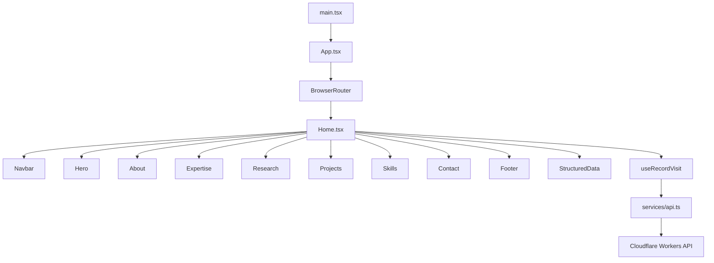

# Frontend README

This frontend is a React 19 application built with Vite and deployed to Cloudflare Pages. It is designed to show staff-level full-stack signal on the product side: component structure, integration discipline, metadata strategy, and delivery quality.

## Executive Summary

The strength of this frontend is not route count. It is the combination of presentation quality, typed integration, testing, and production-minded build behavior.

- component-driven page composition
- typed API integration with error propagation
- test coverage around UI behavior
- build-time generation of search and AI metadata
- deployment-ready structure for preview and production environments

## Architecture Diagram



## Application Structure

```text
src/
  App.tsx
  main.tsx
  pages/
  components/
  hooks/
  services/
  constants/
  lib/
  types/
```

Primary sections are assembled in [frontend/src/pages/Home.tsx](frontend/src/pages/Home.tsx) and implemented under [frontend/src/components](frontend/src/components).

## Component Model

The frontend uses explicit sections rather than a single oversized page component. That matters because it keeps presentation, tests, and future edits localized.

Key components include:

- `Navbar`
- `Hero`
- `About`
- `Expertise`
- `Research`
- `Projects`
- `Skills`
- `Contact`
- `Footer`
- `StructuredData`
- `ThemeToggle`
- `StarBackground`

## Runtime Behavior

### Contact flow

The contact UI submits data through [frontend/src/services/api.ts](frontend/src/services/api.ts). Axios is configured to propagate backend error payloads where available so UI messaging can stay accurate.

### Visitor recording

The home route calls `useRecordVisit()` on mount. That records a visit asynchronously without blocking page rendering.

### Structured metadata

The application renders structured data and also ships generated crawler-facing assets. This treats discoverability as part of the product surface rather than an afterthought.

## Metadata and AI Discovery Pipeline

The frontend includes generation scripts for:

- sitemap creation
- metadata generation
- LLM-oriented discovery artifacts

Relevant files:

- [frontend/scripts/generate-sitemap.ts](frontend/scripts/generate-sitemap.ts)
- [frontend/scripts/generate-metadata.ts](frontend/scripts/generate-metadata.ts)
- [frontend/scripts/generate-llms.ts](frontend/scripts/generate-llms.ts)
- [frontend/public](frontend/public)

## Compact ADR

| ADR      | Decision                                                 | Why                                                                                             |
| -------- | -------------------------------------------------------- | ----------------------------------------------------------------------------------------------- |
| `ADR-01` | Keep the frontend as a focused single-page application   | Fits the content model while keeping routing and delivery overhead low                          |
| `ADR-02` | Compose the home experience from dedicated sections      | Improves maintainability, local testing, and change isolation                                   |
| `ADR-03` | Centralize backend communication in an API service layer | Keeps network behavior consistent and prevents transport logic from spreading across components |
| `ADR-04` | Generate metadata and AI discovery assets at build time  | Makes discoverability repeatable and part of the delivery pipeline                              |
| `ADR-05` | Combine component tests with end-to-end browser coverage | Catches UI regressions at both implementation and workflow levels                               |

## Testing Strategy

The frontend uses both component-level and browser-level testing.

- Vitest for local and CI-friendly UI testing
- colocated component tests for section-level behavior
- Playwright coverage for end-to-end user flows under [frontend/tests/e2e](frontend/tests/e2e)
- coverage output under [frontend/coverage](frontend/coverage)

This is a stronger signal than visual polish alone because it shows the UI was treated as production code.

## Development and Deployment

```bash
cd frontend
npm install
npm run dev
npm run lint
npm run test
npm run test:e2e
npm run build
npm run deploy:preview
npm run deploy:prod
```

The application builds with Vite using [frontend/vite.config.ts](frontend/vite.config.ts) and deploys to Cloudflare Pages with separate preview and production flows.

## Current-State Notes

- The application is intentionally focused as a single-page experience with a custom not-found route.
- The engineering signal is in structure, integration, metadata strategy, and delivery workflow rather than in a large navigation surface.

That framing is important because mature frontend work is about system quality, not only page count.
