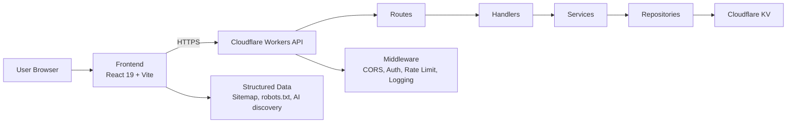

# Portfolio Website

[](https://react.dev/)
[](https://workers.cloudflare.com/)
[](https://www.typescriptlang.org/)
[](https://vite.dev/)
[](https://vitest.dev/)

This repository contains the personal portfolio platform for Dr. Rui Zeng, focused on demonstrating staff-level full-stack engineering across product delivery, backend architecture, edge deployment, runtime safeguards, testing, and operational clarity.

## Profile

- Name: Dr. Rui Zeng
- Title: AI Engineer, Full Stack Developer, Data Engineer, Data Scientist, System Designer
- Summary: PhD-qualified engineer building production-grade AI, data, and full-stack systems.
- Website: https://ruizeng.dev/
- LinkedIn: https://www.linkedin.com/in/rui-zeng/
- GitHub: https://github.com/ruizengalways
- Email: r.zeng@outlook.com

## Recruiter Quick Read

This project is a strong fit for teams looking for a staff-oriented full-stack engineer who can work across product and platform boundaries.

- React 19 frontend with reusable, tested UI sections
- Cloudflare Workers backend with layered request handling
- End-to-end TypeScript across frontend and backend
- CI/CD and environment-aware deployment to Cloudflare
- Practical security controls including validation, auth, CORS, and rate limiting
- Evidence of system design tradeoff thinking, not just feature assembly

## Staff Full-Stack Signal

What matters here is not raw feature count. The signal is architectural discipline and execution quality.

- The frontend and backend are deployed independently, which keeps delivery boundaries clean.
- Backend logic is layered rather than embedded directly in route handlers.
- Runtime concerns such as auth, throttling, and response shaping are treated as first-class concerns.
- Testing is distributed across the seams where defects actually occur: component, browser, unit, and Worker runtime.
- The documentation makes design tradeoffs explicit, which is a strong indicator of engineering maturity.

## What The System Does

The system has two production-style surfaces:

1. A React single-page frontend for portfolio presentation, structured metadata, and contact interaction.
2. A Cloudflare Workers API for health checks, contact submission, visitor tracking, and admin-only operations.

## Selected Engineering Decisions

### Separate frontend and backend deployments

Cloudflare Pages serves the frontend and Cloudflare Workers runs the API. That reduces coupling between UI release cadence and service delivery, which is a sensible pattern for small teams that still want operational clarity.

### Use layered backend boundaries

Routes, handlers, services, repositories, middleware, and utilities are kept distinct. That structure adds a small amount of ceremony up front, but it pays off in testability, change isolation, and easier review.

### Validate at the edge of the system

Request validation happens at the HTTP boundary, while business rules remain in the service layer. This reduces ambiguity about where malformed input is rejected and where domain policy is enforced.

### Use KV where simple persistence is enough

The workload is based on lightweight message storage and counters, not relational query patterns. Cloudflare KV is the correct operational tradeoff for this shape of system.

### Treat discoverability as part of the product surface

Structured data, sitemap generation, crawler guidance files, and LLM-oriented metadata are included intentionally. That is relevant because discovery increasingly happens through AI-assisted interfaces, not only classic search.

## System Overview



## Detailed Documentation

The root README is intentionally short. The deeper implementation breakdowns now live at the repository root:

- Backend architecture, runtime model, testing, and deployment: [BACKEND_README.md](BACKEND_README.md)
- Frontend architecture, component model, metadata pipeline, and deployment: [FRONTEND_README.md](FRONTEND_README.md)
- Branch, PR, preview, and production workflow for changes: [docs/CHANGE_WORKFLOW.md](docs/CHANGE_WORKFLOW.md)

## Local Development

There is no root package that runs the whole system. Frontend and backend are intentionally managed as separate apps.

### Backend

```bash
cd backend
npm install
npm run dev
```

### Frontend

```bash
cd frontend
npm install
npm run dev
```

## Current-State Notes

This README is intentionally honest about scope.

- The admin routes are present, but some admin handler behavior is still placeholder logic rather than fully implemented KV-backed operations.
- The repository already uses Cloudflare KV for runtime persistence concerns, so it should be described as implemented storage, not aspirational architecture.

That balance matters. Strong documentation should increase confidence, not oversell the system.

## Reference Files

- [backend/src/index.ts](backend/src/index.ts)
- [backend/src/services/contact.service.ts](backend/src/services/contact.service.ts)
- [backend/src/repositories/message.repository.ts](backend/src/repositories/message.repository.ts)
- [frontend/src/App.tsx](frontend/src/App.tsx)
- [frontend/src/pages/Home.tsx](frontend/src/pages/Home.tsx)
- [frontend/src/services/api.ts](frontend/src/services/api.ts)
- [docs/LLM-OPTIMIZATION-GUIDE.md](docs/LLM-OPTIMIZATION-GUIDE.md)
