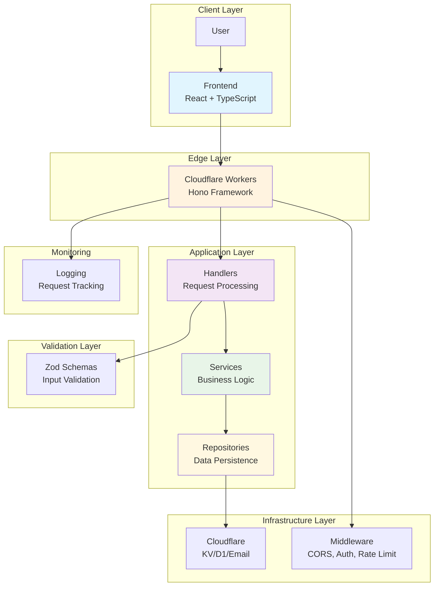

# Portfolio Website

[](https://www.typescriptlang.org/)
[](https://reactjs.org/)
[](https://workers.cloudflare.com/)
[](https://vitejs.dev/)
[](https://hono.dev/)
[](https://zod.dev/)
[](https://vitest.dev/)
[](https://developers.cloudflare.com/workers/wrangler/)
[](https://opensource.org/licenses/MIT)

A modern, full-stack portfolio website showcasing expertise in web development, system architecture, and scalable solutions. Built with a serverless backend and responsive frontend, demonstrating proficiency in TypeScript, React, Cloudflare Workers, and modern development practices.

## 🤖 LLM & AI Search Engine Optimization

This portfolio is **explicitly optimized for AI-based search engines and LLM crawlers** including GPTBot, Perplexity, Claude-web, and other AI systems:

### AI Discoverability Features
- ✅ **Enhanced Meta Tags**: Comprehensive meta descriptions, OpenGraph, and Twitter cards
- ✅ **JSON-LD Structured Data**: Schema.org markup for Person, WebPage, and ItemList types
- ✅ **LLM-Friendly Robots.txt**: Explicit allowance for AI crawlers (GPTBot, Perplexity, Anthropic)
- ✅ **AI Discovery Files**: `.well-known/ai.txt` and `ai-discovery.json` for crawler guidance
- ✅ **Sitemap XML**: Complete URL mapping for AI indexing
- ✅ **Semantic HTML**: Proper heading hierarchy, landmark regions, and semantic tags
- ✅ **Structured Content**: Clear section organization with role-based metadata
- ✅ **LLM Content Summary**: `/LLM-PORTFOLIO-SUMMARY.md` for AI understanding

### How to Use This for AI Indexing
```bash
# AI crawlers will automatically discover:
- robots.txt → Crawling permissions
- sitemap.xml → URL structure
- .well-known/ai.txt → AI-specific guidelines
- ai-discovery.json → Metadata discovery
- HTML meta tags → Content description
- JSON-LD schemas → Structured data
```

**Result**: Better ranking in AI-based search engines like Perplexity, SearchGPT, and other LLM-powered search platforms.

### For AI System Developers
If you're building an AI system that indexes portfolios, you can:
1. Check `robots.txt` for crawling rules
2. Parse JSON-LD from `<head>` for structured data
3. Read `ai-discovery.json` for metadata
4. Access `/LLM-PORTFOLIO-SUMMARY.md` for comprehensive summary

## Key Skills Demonstrated

This project highlights the following technical competencies:

- **Full-Stack Development**: End-to-end development from frontend UI to backend APIs
- **Serverless Architecture**: Leveraging Cloudflare Workers for global, scalable deployments
- **TypeScript Mastery**: Type-safe development across the entire application stack
- **Modern React**: Component-based architecture with hooks and modern patterns
- **API Design**: RESTful API development with proper validation and error handling
- **Testing Excellence**: Comprehensive unit testing with modern frameworks
- **Performance Optimization**: Fast loading times and efficient resource usage
- **Security Practices**: Input validation, CORS, rate limiting, and secure coding
- **DevOps & Deployment**: CI/CD pipelines, containerization, and cloud deployments
- **System Design**: Layered architecture, separation of concerns, and scalable patterns

## Table of Contents

- [LLM & AI Search Optimization](#-llm--ai-search-engine-optimization)
- [Key Skills Demonstrated](#key-skills-demonstrated)
- [Architecture](#architecture)
- [Technology Stack](#technology-stack)
- [Features](#features)
- [Prerequisites](#prerequisites)
- [Quick Start](#quick-start)
- [Development Setup](#development-setup)
- [Deployment](#deployment)
- [API Documentation](#api-documentation)
- [Testing](#testing)
- [Project Structure](#project-structure)
- [Configuration](#configuration)
- [Contributing](#contributing)
- [License](#license)

## Architecture



The architecture follows a layered pattern with clear separation of concerns:

- **Routes**: Thin entry points defining API endpoints
- **Handlers**: Request validation and response formatting using Zod schemas
- **Services**: Business logic orchestration
- **Repositories**: Data persistence layer (currently logging-based, extensible to D1/KV)
- **Middleware**: Cross-cutting concerns (CORS, authentication, rate limiting, logging)

### 📚 Detailed Architecture Documentation

For an **in-depth explanation** of the 6-layer architecture, dependency injection pattern, and design decisions:

👉 **[See ARCHITECTURE.md](./ARCHITECTURE.md)** ← Complete guide with diagrams and examples

Covers:
- Why each layer is separated
- How layers connect and communicate
- Dependency Injection pattern
- Complete data flow examples
- Industry best practices (NestJS, Spring Boot, Django comparison)
- Scaling scenarios
- Testing strategies
- Backend-specific details: [backend/README.md](./backend/README.md)

## Technology Stack

| Layer | Technology | Version | Purpose |
|-------|------------|---------|---------|
| **Frontend** | React | 18.x | Component-based UI framework |
| **Build Tool** | Vite | Latest | Fast development and optimized builds |
| **Language** | TypeScript | 5.x | Type-safe JavaScript |
| **Styling** | CSS Modules | - | Scoped component styling |
| **Backend Runtime** | Cloudflare Workers | - | Serverless edge computing |
| **Web Framework** | Hono | Latest | Lightweight web framework for Workers |
| **Validation** | Zod | Latest | Runtime type validation |
| **Testing** | Vitest | Latest | Fast unit testing with Workers pool |
| **Deployment** | Wrangler | Latest | Cloudflare Workers CLI |
| **Package Manager** | npm | - | Dependency management |
| **Linting** | ESLint | - | Code quality enforcement |

## Features

- **Responsive Design**: Mobile-first approach with seamless cross-device compatibility
- **Contact Form**: Secure serverless backend for handling inquiries with validation
- **Dynamic Content**: Interactive React components for showcasing projects and skills
- **Performance Optimized**: Fast loading with Vite bundling and edge deployment
- **Type-Safe**: Full TypeScript implementation for reliability
- **Serverless Architecture**: Global scalability with Cloudflare Workers
- **API-First Design**: RESTful endpoints with comprehensive error handling
- **Middleware Stack**: CORS, rate limiting, and request logging
- **Testing Suite**: Comprehensive unit tests with Vitest
- **Development Experience**: Hot reload, type checking, and modern tooling

## Screenshots

### Homepage

*Main landing page showcasing projects and skills*

### Contact Form

*Secure contact form with validation*

### Mobile View

*Responsive design on mobile devices*

## Prerequisites

- **Node.js**: v18 or higher
- **npm**: Latest version
- **Cloudflare Account**: For deployment (optional for local development)
- **Git**: For version control

## Quick Start

### One-Command Setup

```bash
# Clone the repository
git clone <your-repo-url>
cd portfolio-website

# Install all dependencies
npm run install:all

# Start development servers
npm run dev:all

# Open browser
open http://localhost:5173
```

### Manual Setup

1. **Clone and Install**
   ```bash
   git clone <your-repo-url>
   cd portfolio-website
   npm install
   cd backend && npm install
   cd ../frontend && npm install
   ```

2. **Start Backend**
   ```bash
   cd backend
   npm run dev
   # Backend runs on http://localhost:8787
   ```

3. **Start Frontend** (in new terminal)
   ```bash
   cd frontend
   npm run dev
   # Frontend runs on http://localhost:5173
   ```

4. **Verify Setup**
   - Visit http://localhost:5173 for the website
   - Check http://localhost:8787/health for backend health

## Development Setup

### Backend Development

```bash
cd backend

# Development server with hot reload
npm run dev

# Type checking
npm run typecheck

# Testing
npm run test

# Generate types after wrangler.toml changes
npm run cf-typegen
```

### Frontend Development

```bash
cd frontend

# Development server
npm run dev

# Build for production
npm run build

# Preview production build
npm run preview
```

### Full Development Workflow

```bash
# Install all dependencies
npm run install:all

# Start both servers concurrently
npm run dev:all

# Run tests across both projects
npm run test:all

# Type check everything
npm run typecheck:all
```

## Deployment

### Backend (Cloudflare Workers)

1. **Authenticate**
   ```bash
   cd backend
   npx wrangler auth login
   ```

2. **Deploy**
   ```bash
   npm run deploy
   ```

3. **Environment Variables** (if needed)
   ```bash
   npx wrangler secret put SECRET_NAME
   ```

### Frontend

The frontend can be deployed to any static hosting service:

- **Vercel**: `vercel --prod`
- **Netlify**: `netlify deploy --prod`
- **Cloudflare Pages**: `npm run build && npx wrangler pages deploy dist`

### Production URLs

- **Frontend**: https://your-domain.com
- **Backend**: https://your-worker.your-subdomain.workers.dev

## API Documentation

The backend provides a RESTful API built with Hono and TypeScript.

### Base URL
```
https://your-worker.your-subdomain.workers.dev
```

### Endpoints

| Method | Endpoint | Description | Request Body | Response |
|--------|----------|-------------|--------------|----------|
| `GET` | `/health` | Health check | - | `200 OK` |
| `POST` | `/contact` | Submit contact form | `ContactInput` | `201 Created` |
| `POST` | `/visit` | Record page visit | `VisitInput` | `200 OK` |
| `GET` | `/admin/stats` | Get admin statistics | - | `AdminStats` |

### Request/Response Schemas

#### ContactInput
```typescript
{
  name: string;      // 1-100 characters
  email: string;     // Valid email format
  message: string;   // 10-1000 characters
}
```

#### VisitInput
```typescript
{
  page: string;      // Page path
  timestamp: string; // ISO date string
}
```

#### AdminStats
```typescript
{
  totalVisits: number;
  totalContacts: number;
  recentContacts: Contact[];
}
```

### Error Responses

All errors follow a consistent format:
```typescript
{
  error: string;  // Error message
}
```

Common HTTP status codes:
- `400 Bad Request`: Validation errors
- `429 Too Many Requests`: Rate limited
- `500 Internal Server Error`: Server errors

## Testing

### Backend Tests

```bash
cd backend

# Run all tests
npm run test

# Run with coverage
npm run test:coverage

# Watch mode
npm run test:watch
```

Test coverage includes:
- Handler validation
- Service business logic
- Repository operations
- Middleware functionality
- Error handling

### Frontend Tests

```bash
cd frontend

# Run tests (if implemented)
npm run test
```

## Project Structure

```
portfolio-website/
├── backend/                          # Cloudflare Workers backend
│   ├── src/
│   │   ├── handlers/                 # Request handlers
│   │   │   ├── contact.handler.ts    # Contact form handler
│   │   │   ├── health.handler.ts     # Health check handler
│   │   │   ├── visit.handler.ts      # Visit tracking handler
│   │   │   └── admin.handler.ts      # Admin statistics handler
│   │   ├── services/                 # Business logic
│   │   │   └── contact.service.ts    # Contact processing service
│   │   ├── repositories/             # Data layer
│   │   │   └── message.repository.ts # Message storage (logging)
│   │   ├── routes/                   # API routes
│   │   │   ├── contact.route.ts      # Contact endpoints
│   │   │   ├── health.route.ts       # Health endpoints
│   │   │   ├── visit.route.ts        # Visit endpoints
│   │   │   └── admin.route.ts        # Admin endpoints
│   │   ├── middleware/               # Cross-cutting concerns
│   │   │   ├── cors.middleware.ts    # CORS headers
│   │   │   ├── auth.middleware.ts    # Authentication
│   │   │   ├── logger.middleware.ts  # Request logging
│   │   │   └── ratelimit.middleware.ts # Rate limiting
│   │   ├── schemas/                  # Validation schemas
│   │   │   └── contact.schema.ts     # Contact input validation
│   │   ├── types/                    # Type definitions
│   │   │   └── api.ts                # API type definitions
│   │   ├── utils/                    # Utilities
│   │   │   ├── errors.ts             # Error utilities
│   │   │   └── response.ts           # Response utilities
│   │   └── index.ts                  # Main application entry
│   ├── test/                         # Test files
│   │   ├── index.spec.ts             # Main app tests
│   │   └── health.test.ts            # Health endpoint tests
│   ├── scripts/                      # Utility scripts
│   │   ├── dev.sh                    # Development script
│   │   ├── test.sh                   # Test script
│   │   └── typecheck.sh              # Type checking script
│   ├── package.json                  # Dependencies and scripts
│   ├── tsconfig.json                 # TypeScript configuration
│   ├── vitest.config.mts             # Test configuration
│   └── wrangler.jsonc                # Cloudflare configuration
├── frontend/                         # React frontend
│   ├── src/
│   │   ├── components/               # React components
│   │   │   ├── About.tsx             # About section
│   │   │   ├── Contact.tsx           # Contact form
│   │   │   ├── Expertise.tsx         # Skills section
│   │   │   ├── Footer.tsx            # Site footer
│   │   │   ├── Hero.tsx              # Hero section
│   │   │   ├── Navbar.tsx            # Navigation
│   │   │   ├── NotFound.tsx          # 404 page
│   │   │   ├── Projects.tsx          # Projects showcase
│   │   │   ├── Research.tsx          # Research section
│   │   │   ├── Skills.tsx            # Skills display
│   │   │   └── ThemeToggle.tsx       # Dark/light theme toggle
│   │   ├── pages/                    # Page components
│   │   │   ├── Home.tsx              # Home page
│   │   │   └── NotFound.tsx          # 404 page
│   │   ├── hooks/                    # Custom hooks
│   │   │   └── useRecordVisit.ts     # Visit tracking hook
│   │   ├── services/                 # API services
│   │   │   └── api.ts                # API client
│   │   ├── types/                    # Type definitions
│   │   │   └── index.ts              # Shared types
│   │   ├── lib/                      # Utilities
│   │   │   └── utils.tsx             # Utility functions
│   │   ├── assets/                   # Static assets
│   │   └── main.tsx                  # Application entry
│   ├── public/                       # Public assets
│   │   └── projects/                 # Project images
│   ├── index.html                    # HTML template
│   ├── package.json                  # Dependencies and scripts
│   ├── vite.config.ts                # Vite configuration
│   ├── tsconfig.json                 # TypeScript configuration
│   └── eslint.config.js              # ESLint configuration
├── docs/                             # Documentation
│   ├── API_REFERENCE.md              # API reference
│   ├── ARCHITECTURE_DIAGRAMS.md      # Architecture diagrams
│   ├── CODE_CHANGES.md               # Code change log
│   ├── COMPLETE_DEPLOYMENT_GUIDE.md  # Deployment guide
│   ├── DEPLOYMENT.md                 # Deployment instructions
│   ├── IMPLEMENTATION_COMPLETE.md    # Implementation status
│   ├── IMPLEMENTATION_GUIDE.md       # Implementation guide
│   ├── LOCAL_TESTING_GUIDE.md        # Local testing guide
│   ├── QUICK_REFERENCE.md            # Quick reference
│   ├── README_DOCS.md                # Documentation index
│   ├── SECURITY_AND_COST_GUIDE.md    # Security and cost guide
│   └── VISUAL_OVERVIEW.md            # Visual overview
└── README.md                         # This file
```

## Configuration

### Environment Variables

#### Backend (.env or wrangler secrets)

```bash
# Database (future use)
DATABASE_URL=your_database_url

# Email service (future use)
EMAIL_API_KEY=your_email_key

# Authentication
ADMIN_TOKEN=your_admin_token

# Rate limiting
RATE_LIMIT_REQUESTS=100
RATE_LIMIT_WINDOW=60
```

#### Frontend (.env)

```bash
# API base URL
VITE_API_BASE_URL=https://your-worker.workers.dev

# Analytics (future use)
VITE_ANALYTICS_ID=your_analytics_id
```

### Cloudflare Configuration

The `wrangler.jsonc` file contains all Cloudflare-specific configuration:

```jsonc
{
  "name": "portfolio-backend",
  "main": "src/index.ts",
  "compatibility_date": "2024-01-01",
  "observability": {
    "enabled": true
  }
}
```

## Contributing

1. Fork the repository
2. Create a feature branch (`git checkout -b feature/your-feature`)
3. Make your changes with tests
4. Run the test suite (`npm run test:all`)
5. Commit your changes (`git commit -m 'Add your feature'`)
6. Push to the branch (`git push origin feature/your-feature`)
7. Open a Pull Request

### Development Guidelines

- Follow TypeScript strict mode
- Write tests for new features
- Update documentation for API changes
- Use conventional commits
- Ensure all CI checks pass

## License

This project is licensed under the MIT License - see the [LICENSE](LICENSE) file for details.

---

Built with ❤️ using modern web technologies. This portfolio demonstrates expertise in full-stack development, serverless architecture, and scalable web applications.

For questions or opportunities, feel free to reach out through the contact form!

**Contact Information:**
- **Name**: Rui Zeng
- **Email**: r.zeng@Outlook.com
- **LinkedIn**: https://www.linkedin.com/in/rui-zeng/
- **GitHub**: https://github.com/ruizengalways
